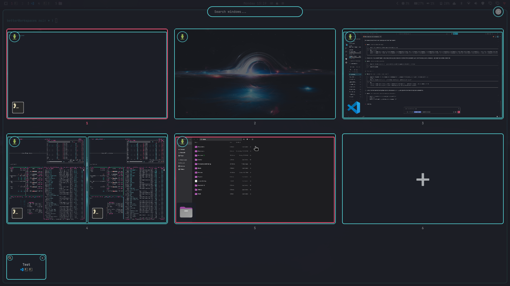
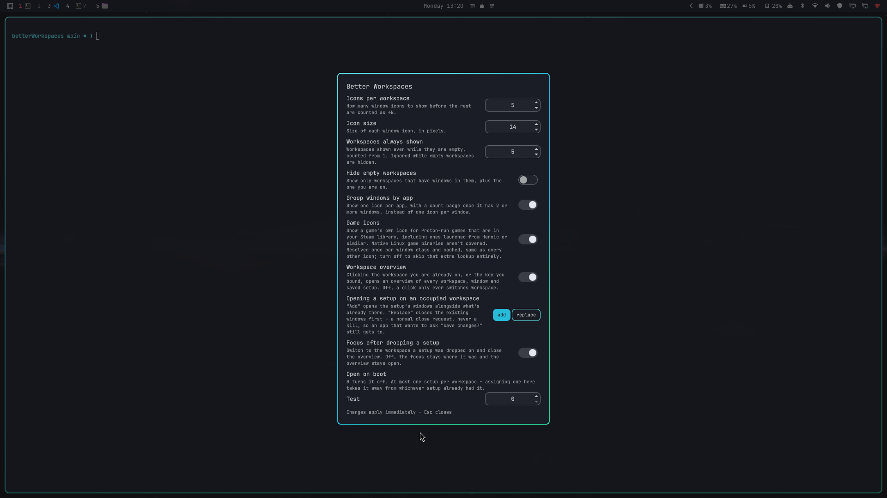

# Better Workspaces

An [Omarchy](https://omarchy.org/) shell plugin that replaces the built-in
`omarchy.workspaces` bar widget with one that also shows a small icon for
every window open on each workspace - so you can see what's actually running
where, not just which workspaces are occupied.

Icons come from your installed applications' own icon (resolved the same way
the Omarchy menu resolves app icons), so new apps get an icon automatically
with no configuration.

**Web apps** get the icon of the launcher that opened them. A Chromium-family
browser (Chromium, Chrome, Brave, Edge, Vivaldi, Helium, ...) names an
`--app=<url>` window after its URL, which is exactly how `omarchy webapp
install` launchers open - so the window is matched to the installed launcher
whose command opens the same site. No list of known sites, and nothing is
guessed from the page title. Installed PWAs from Chromium's "Install app",
Firefox PWAs ([PWAsForFirefox](https://github.com/filips123/PWAsForFirefox))
and GNOME Web apps ship a desktop entry named after their window class, so
they match directly. A normal browser window with several tabs is one window
and keeps the browser's icon.

**Games** get their own icon too (`gameIcons`), whichever launcher started
them. Steam, Proton/umu, Heroic and Lutris each start a game with
environment variables saying which game it is (`SteamAppId`,
`HEROIC_APP_NAME`, `GAME_NAME`), and every window of the game inherits them.
So the icon is Steam's `steam_icon_<appid>`, Heroic's cached cover icon
(`~/.config/heroic/icons`, or the Flatpak's), or Lutris's `lutris_<slug>`
icon or the game's menu shortcut. This works for native Linux builds as well
as Proton games. Steam Proton games are also still recognized straight from
their `steam_app_<appid>` window class.

You can override any app's icon per-window-class if the automatic match isn't
the one you want.

Everything is resolved from Hyprland's own IPC event stream and Quickshell's
built-in desktop-entry/icon-theme lookups - no polling, no shelling out to
external commands. Icon lookups are cached by window class, so repeat windows
of the same app (e.g. two terminals) never repeat the lookup. The game check
reads each window's `/proc/<pid>/environ` once and caches the answer.


## Using the icons

- Hover an icon to see that window's title as a tooltip.
- Left-click an icon to focus that exact window, switching workspace if it is
  on another one.
- Middle-click an icon to close that window.
- Clicking the workspace number or anywhere else in the cell still just
  focuses the workspace, same as before.

With `groupApps` on, windows of the same app share one icon with a count
badge once there are 2 or more. Hovering lists every window's title; left-
click focuses the group's most recently focused window, and each further
click steps to the next one. Middle-click closes the currently focused (or
last-focused) window in the group. `maxIcons` and the `+N` overflow then
count apps, not windows.

## The overview

Every workspace as a card, laid out to fill the screen, each showing its
wallpaper with its windows drawn where they really sit on it. That is the
whole view - the cards are large enough to recognise a window in, so there is
nothing else to page through. A card is the shape of the screen its workspace
is on, and every window carries its app icon in the corner, so a black
terminal is still obviously a terminal.



### Opening it

Three ways, none of which touches your Hyprland bindings:

- **Click the workspace you are already on** in the bar. Clicking any other
  workspace still just switches to it, as before. This is the one that needs
  no setup; `overviewEnabled` turns it back into a plain switch.
- **A key of your own**, added to `~/.config/hypr/bindings.lua`. `SUPER + Q`
  is free in a stock Omarchy:

  ```lua
  o.bind("SUPER + Q", "Workspace overview",
    [[omarchy-shell shell toggle better-workspaces '{}']])
  ```

  `./scripts/install-bindings.sh` does this for you, along with the save and
  settings bindings below - see [Install](#install).

- **A touchpad gesture**, in `~/.config/hypr/input.lua` - for example a
  three-finger swipe up:

  ```lua
  hl.gesture({ fingers = 3, direction = "up", action = function()
    hl.dispatch(hl.dsp.exec_cmd("omarchy-shell shell toggle better-workspaces '{}'"))
  end })
  ```

It opens on the monitor Hyprland says has focus. The same command closes it
again, as do `Esc` and a click past the cards.

### Using it

- **Click a window** to go straight to it - the right workspace and the right
  window in one - and the overview closes behind you.
- **Middle-click a window** to close it, same as in the bar. The overview
  stays open.
- **Click anywhere else on a card** to go to that workspace; the overview
  closes too.
- **Drag a window onto another card** to move it there. The focus stays where
  it is, so you can keep rearranging. Dropping it back where it came from
  does nothing.
- **Drag a window onto the `+` card** to move it to a new workspace. `+`
  always offers the one after the highest you have: a strip of 1-5 offers 6,
  and one that already reaches 8 offers 9. The number under the card says
  which one you are about to get.
- **Drag the number under a card** onto another card to reorder workspaces.
  Hyprland can't renumber a workspace, so this moves the windows instead:
  dropping 5 onto 2 leaves 5's windows on 2, 2's on 3, and so on. Nothing is
  renamed. The number is the handle rather than the card itself because a
  busy workspace leaves no empty spot on its card to grab.
- **Arrow keys or `hjkl`** walk the cards, **Enter** opens the selected one
  (or makes the new one, on `+`), **Esc** closes.
- **The scroll wheel** walks them too, one card per notch, in the order they
  are laid out. It moves the selection rather than switching workspace, the
  same as the arrow keys - the overview's own way round is "pick, then open".
  The bar widget deliberately doesn't do this: a stray notch there would
  switch workspace outright.
- **The search box** sits over the cards the whole time you're there - **`/`**
  just moves keyboard focus into it. Every window that doesn't match what
  you type - by title or by app - dims across every workspace at once, so a
  window you can't place by eye is still findable by name. **Enter** goes
  straight to the first match, in workspace order; **Esc** clears it and
  hands focus back to the cards without closing the overview (a second
  `Esc` closes that).
- **The gear in the top-right corner** opens the settings over the cards.
  They stay on screen, previews and all, because most of the settings change
  what the overview shows - `Esc` there goes back to them rather than closing
  everything.
- **The save icon in a card's top-left corner** saves that workspace - its
  open windows, ready to reopen later. Not necessarily the one you're on:
  each card saves itself. Same `Esc`-goes-back behaviour as the gear.

To save the workspace you're on right now without opening the overview at
all, bind a key of your own in `~/.config/hypr/bindings.lua`. `SUPER + SHIFT
+ Q` is free in a stock Omarchy:

```lua
o.bind("SUPER + SHIFT + Q", "Save current workspace",
  [[omarchy-shell shell toggle better-workspaces '{"view":"save"}']])
```

This opens straight on the save dialog for whichever workspace is focused;
`Esc` or a click outside it closes it right away, with no overview behind it
to step back to.

### Saved setups

Once you've saved at least one, a strip of them sits along the bottom of the
overview - a small icon per app plus the name.

- **Click one** to open it on whichever workspace was active when you opened
  the overview, and close the overview.
- **Drag one onto a workspace card** to open it there instead, or onto `+`
  for a new workspace. Whether that closes the overview and switches you
  there depends on `focusAfterSetupDrop` (on by default) - off leaves you
  where you were, with the overview still open, while the new windows appear
  on the card. Rebuilding the layout still needs focus on the target
  workspace while it's happening either way, so with the setting off you'll
  see a brief jump over there and back.
- **If the target workspace already has windows on it**, `setupTargetMode`
  decides what happens: `add` (the default) opens the setup's windows
  alongside what's there; `replace` closes the existing ones first with a
  normal close request (never a kill), so an app that wants to ask "save
  changes?" still gets to - and waits for them to actually be gone (up to a
  few seconds) before opening the setup, so its windows don't land on a
  workspace that still has the old ones on it too. An app that never closes
  doesn't block it forever; the setup opens alongside it once that wait runs
  out.
- **The × in a chip's corner** deletes it, after asking you to confirm.
- **The button in the chip's other corner** assigns which workspace it opens
  on at boot (see below) - a click opens a small picker of "off" plus every
  workspace, right there, without going through the settings form. The
  button itself shows that workspace's number, or a themed icon (with a
  glyph fallback) while it's off.

**Updating one** with whatever is open now: the save dialog lists every setup
you already have under the name field. Picking one fills its name in rather
than making you retype it exactly, and then stops at the same "press Enter
again to overwrite" confirmation a name you typed yourself would get.

**Renaming one** is in the settings (see [The edit view](#the-edit-view)).

Reopening a setup replays each window's own launch recipe (its installed
app, or the exact command line if it isn't one) and rebuilds the left/right,
top/bottom split it was saved with. Sizes land on Hyprland's own default
split ratio rather than the exact proportions you saved - and the layout is
only exact on an empty workspace; dropped onto a busy one, it's best-effort.

### Previews

Window previews come from the compositor's screencopy protocol, and only
while the overview is actually open - closing it tears every capture down.
Only the workspace you are on keeps updating; every other card takes a single
frame and then stops. A window the compositor won't hand a frame for shows
its app icon on a plain surface instead.

Where a window sits comes from its `hyprctl clients` entry, which Hyprland
can deliver later than the window itself, so the overview asks Hyprland for
fresh geometry as it opens. That is a single request on the way in, not a
poll.

## Install

```bash
omarchy plugin add https://github.com/LukasTrust/betterWorkspaces.git --enable
```

Omarchy's installer never runs plugin code or install hooks, so the three
keybindings above aren't set up for you automatically - add them by hand as
shown above, or run the plugin's own opt-in script once, from a checkout:

```bash
cd ~/.config/omarchy/plugins/better-workspaces  # or wherever you cloned it
./scripts/install-bindings.sh
```

It checks each of the three candidate keys against `omarchy menu
keybindings --print` - Omarchy's own resolved list, defaults and your
overrides both - and only ever adds ones that are free. Anything already
bound to something else is reported and left alone; if that's `SUPER + Q`
specifically, the one the overview actually needs, it aborts before writing
anything at all, rather than leaving you with only the other two. Run it
again any time - already-installed bindings are recognised as such and
skipped, not duplicated. It backs up `bindings.lua` with a timestamp before
writing. A key that's bound to something carrying no description of its own
counts as taken like any other, rather than as free.

`./scripts/uninstall-bindings.sh` takes them back out again - see [Remove](#remove).

## Manual / dev install

```bash
ln -s /path/to/betterWorkspaces ~/.config/omarchy/plugins/better-workspaces
omarchy plugin enable better-workspaces --section left
```

Omarchy's plugin watcher doesn't follow symlinks, so edits in the checkout
aren't hot-reloaded. Re-creating the link (`ln -sfn "$PWD"
~/.config/omarchy/plugins/better-workspaces`) triggers Omarchy's plugin
reload, but that doesn't reliably pick up the new code; `omarchy restart
shell` always does. To check a change without touching your bar, use the
tests below - they always run the current checkout.

## Remove

```bash
omarchy plugin disable better-workspaces   # keep it installed, just hide it
omarchy plugin remove better-workspaces    # uninstall entirely
```

Removing it restores the stock `omarchy.workspaces` widget and drops this
widget's entry from `shell.json`. Two things it wrote outside its own
directory outlive it, because `omarchy plugin remove` only ever touches the
plugin directory and `shell.json`:

- **Saved setups**, in `~/.config/omarchy/better-workspaces/`. Kept on
  purpose - reinstalling picks them straight back up, and a setup is work you
  did rather than something the plugin generated.
- **Keybindings**, if you ran `./scripts/install-bindings.sh`. Left behind they point
  at a command that no longer answers.

The install script's own counterpart clears both:

```bash
./scripts/uninstall-bindings.sh            # remove the keybindings it added
./scripts/uninstall-bindings.sh --purge    # and delete the saved setups too
```

It only removes bindings that script wrote, recognised by the marker comment
it leaves behind, and backs up `bindings.lua` with a timestamp first. A
binding you added by hand is reported and left alone - there's no marker to
tell it apart from any other line you wrote yourself. Run it before or after
`omarchy plugin remove`; the order doesn't matter.

## Configuration

### The edit view

Every setting except the per-app `icons` overrides is also in Omarchy's own
**Setup > Plugins** form, alongside every other widget's. This view is the
richer one - it applies as you type and carries the per-setup rows below -
but the Setup menu is where you'd look first, so both are there. They write
the same `shell.json` keys, so neither can disagree with the other.

The gear in the overview's top-right corner opens this view, or bind it to a
key of its own in `~/.config/hypr/bindings.lua`:

```lua
o.bind("SUPER + SHIFT + ALT + Q", "Better Workspaces settings",
  [[omarchy-shell shell toggle better-workspaces '{"view":"settings"}']])
```

Changes apply as you make them and are written back to your `shell.json`
entry. Values outside the allowed range are pulled to the nearest one, and
anything unusable falls back to the default.



`Esc`, or a click outside the card, closes the editor - or, when you got
there through the overview's gear, steps back to the overview so you can see
what your change did.

Below the settings, once you've saved at least one setup, is a row per setup:
its name, and which workspace it should open on at boot (`0` for none).

**Rename** a setup by typing over its name and pressing Enter. Everything it
holds - its windows, its boot workspace - comes along. A blank name, or one
another setup is already using, is refused and says so rather than going
ahead: taking a name in use would drop the setup that had it.

The boot number is the same assignment each setup's own chip in the overview
lets you make directly (see above), just listed all in one place here. Giving
one a workspace another setup already had takes it away from that one - only
one setup can claim a given workspace.

Any setup with a boot workspace assigned opens automatically once, the first
time Hyprland starts - after waiting for every monitor to be detected, so a
multi-monitor layout doesn't land on the wrong screen. It only runs once per
Hyprland session: `omarchy restart shell` (or anything else that restarts
this plugin) won't reopen everything a second time.

### shell.json

The per-app `icons` overrides are only editable here. Everything is
configured inline in `~/.config/omarchy/shell.json`, on this widget's layout
entry:

```jsonc
{
  "id": "better-workspaces",
  "maxIcons": 5,           // icons shown per workspace before "+N" overflow
  "iconSize": 14,          // icon size in px
  "minWorkspaces": 5,      // workspaces shown even while empty, counted from 1
  "hideEmpty": false,      // show only workspaces with windows in them
  "groupApps": false,      // one icon per app, with a count badge, instead of one per window
  "gameIcons": true,       // a Steam/Heroic/Lutris game's own icon instead of the generic fallback
  "overviewEnabled": true, // clicking the workspace you are on opens the overview
  "setupTargetMode": "add",     // "add" or "replace" existing windows when opening a setup on a busy workspace
  "focusAfterSetupDrop": true,  // switch to the target workspace and close the overview after dropping a setup
  "icons": {
    // Override the icon for a window class/appId. Value can be either an
    // icon-theme name or a literal glyph/emoji.
    "firefox": "🦊",
    "code": "󰨞",
    "steam": ""
  }
}
```

Window class/appId matching is case-insensitive. To find a window's class,
run `hyprctl clients` and look at its `class` field.

A workspace above `minWorkspaces` is shown while Hyprland knows about it,
which is as long as it has windows or you are on it. With `hideEmpty` on,
`minWorkspaces` is ignored and the bar shows only the workspaces that have
windows in them, plus the one you are on - so the strip grows and shrinks as
you work.

## The code

QML holds everything that needs a live Quickshell, Hyprland or a window;
`js/` holds the pure decisions, so they run under plain Node in the tests
with no compositor at all. Each file stands alone and a QML file imports
the ones it needs:

| File | What it decides |
|------|-----------------|
| `js/settings.js` | The shell.json settings - ranges, fallbacks, what a hand-edited value is pulled to - and the workspace strip they decide |
| `js/icons.js` | What a window is, which icon stands for it, and the overview's search |
| `js/selector.js` | How a Hyprland dispatch names one particular window |
| `js/cards.js` | The overview's card layout, navigation, and reorder drags |
| `js/views.js` | Which view the overlay shows, and what Escape does there |
| `js/setups.js` | The setups.json contract: validation, naming, capturing, boot |
| `js/splits.js` | Working a dwindle split tree back out of saved rectangles |

None of them imports another. A QML JavaScript resource can only import one
with `.import`, which plain Node can't parse - so the choice is between
these files being importable from QML and being testable under Node, and
they are testable. That is also why the two three-line helpers `own` and
`isPlainObject` appear in more than one file.

## Testing

Three levels, from fast and isolated to real:

```bash
npm test            # js/ unit tests + coverage gate, stand-in API check
npm run test:qml    # widget behaviour, headless, against stand-in modules
npm run test:e2e    # real windows on your live Hyprland session
```

- **`npm test`** runs the pure logic in `js/` under plain Node, with a
  coverage gate per file. It also checks that every member of the QML test
  stand-ins exists on the real Quickshell/Omarchy type, so a QML test can't
  pass against an API that doesn't exist (skipped where Quickshell isn't
  installed, e.g. in CI).
- **`npm run test:qml`** loads `Workspaces.qml` in `qmltestrunner` against
  the stand-ins in `test/qml/stubs`, so it needs neither Hyprland nor
  Omarchy. Needs `qmltestrunner` (Arch: `qt6-declarative`).
- **`npm run test:e2e`** opens real `foot` windows and checks what the
  widget reports it shows, and that the requests the overview sends really do
  move windows between workspaces on a running Hyprland. By default it runs
  the current checkout in a throwaway Quickshell instance (real modules, no
  window, doesn't touch your bar); `npm run test:e2e -- --live` asks the
  widget on your bar instead. It briefly switches to free workspaces between
  6 and 10 - don't type while it runs. Needs `foot` and `jq`.

The widget reports what it's showing as JSON, which is what the end-to-end
tests read:

```bash
omarchy-shell better-workspaces state
```

Before publishing a change, also validate the plugin the way Omarchy does:

```bash
omarchy plugin validate .
qmllint -I "$OMARCHY_PATH/shell" qml/*.qml
```

## License

MIT - see [LICENSE](LICENSE).
